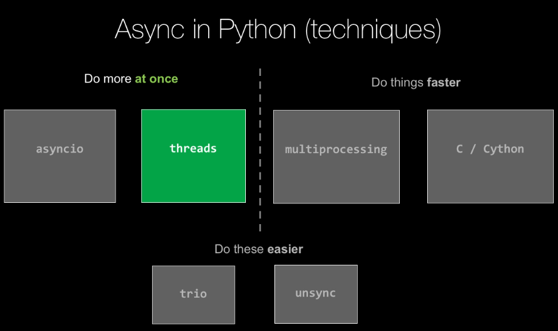

1. Concurrency (I/O)

- asyncio (async and await)

  https://github.com/MagicStack/uvloop

  https://github.com/MagicStack/asyncpg

  https://github.com/Scille/umongo

  https://github.com/Tinche/aiofiles

  https://github.com/jonathanslenders/asyncio-redis
- Multithreading

2. Parallelism (CPU)

- Multiprocessing
- Cython

3. Hybrid
- unsync
  https://github.com/alex-sherman/unsync

- trio
  Unsynchronize asyncio by using an ambient event loop, or executing in separate threads or processes.
