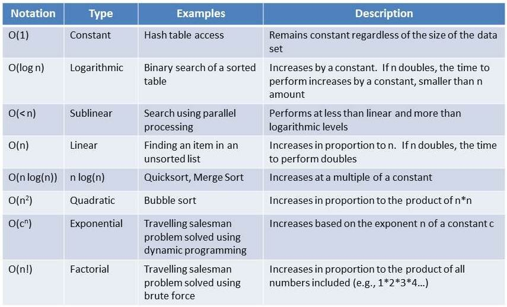

https://www.bigocheatsheet.com/

https://www.kaggle.com/code/ozkanozturk/big-o-notation-code-complexity-python-basics

Big-O : Testing the code complexity in the worst case scenario
Omega : Testing the code complexity in the best case scenario
Tetam : Testing the code complexity in the mid case scenario

Big O notation is a mathematical notation that describes the limiting behavior of a function when the argument tends towards a particular value or infinity.

We will need a measurement that is independent of the machine and can tell us what will happen with our algorithm when the size of the input gets larger and larger. Here comes the BigO Notation.

BigO aims to find how many operations you need to perform in the worst-case scenario given an input of any size.

BigO does is to give you a math function that is purely focused on finding the limit of the number of operations you need to perform when the size of the input gets larger.

BigO notation, we are always interested in the worst case (with some exceptions like hash maps).

1) Time complexity \
   Time Complexity by simply counting the number of the auxiliary operations you perform on the given data structure.

2) Space Complexity analysis \
    sd

