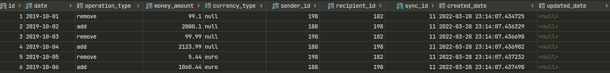

# Test task: Application to merge input data from CSV files and store to DB w/ further conversion to CSV or any other format (JSON, XML, ...)

## 1. Requirements

### SOBERS Assignment
# Introduction
For this assingment our client has a website that takes personal export of banking history.
And displays it in the frontend.
There is already a version that runs for single bank.
But now you have the task to create a script that parses data from multiple banks.
In the future the client wants to add more banks.

# Assingment
You are tasked to create script that will parse multiple csv's and create a unified csv.
There are 3 different csv's, this will increase in the future.
The client has as hard requirement that the result is stored as csv file.
But json and xml will be used in the future, maybe even storing the result in a database.

In the data folder there are 3 csv's with banking data.
Since the csv's come from different banks the layout of data can differ.
The bank statements have data from the month October.

# Scoring
create a script according to above specified requirements.
You are allowed to take as much time as needed, But try to manage your time to around 1 or 2 hours.
Since we are Python shop the script must be done with Python.
Scoring is based on:
- Correctness
- Code archticture
- Maintainablity
- Testablity
- Extendablity
- Pythonicness of code

Test are not required, but plus points for tests.
This is moment for to show your skills. 

## 2. Solution

### 2.0 Notes:
- Consider do not use floating for finance data (because floats and doubles cannot accurately represent the base 10 multiples that we use for money. It's for any programming language that uses base 2 floating-point types)
  https://en.wikipedia.org/wiki/Floating-point_arithmetic
- `transactions` table columns: date: date, operation_type: enum, currency_type: enum, sender_id: int, recipient_id: int
 * `date` can be migrated in future to datetime, for now not needed to make it complex and fill with some time part
 * `currency_type`: euro or None by default in cause info from input data not clear which currency is processing (to avoid make not strict conclusions)

### 2.1 Description

### 2.2 TODO
**Planned**
- Check new data in input dir in case new run load
- Add timeing for load data
- Implement merge CSV by pandas
- Add new format of CSV error checks
- Store sync process to DB w/ not parsed items and reason to DB
- Use ORM to store merged data to DB (source of truth)
- Add converting of merged data from DB to CSV, XML, JSON.
- Add scheduler for sync
- Add Web handler to make sync by demand w/ force options
- Logging, Progress repr

**Optional:**
- Add tests
- Docker
- Deploy
- Add linters

### 2.3 Project run

Project run:
1) Clone repo.
2) Install Python 3.x and pip3.
3) Create venv:\
   `python3.10 -m virtualenv .venv & source .venv/bin/activate`
   `pipreqs` - tools to generate deps based on project imports.
4) Install deps: \
   `pip3 install -r requirements.txt`
5) Run:
`cd bin & python3 load_data.py`
#TODO: sh, web-handler