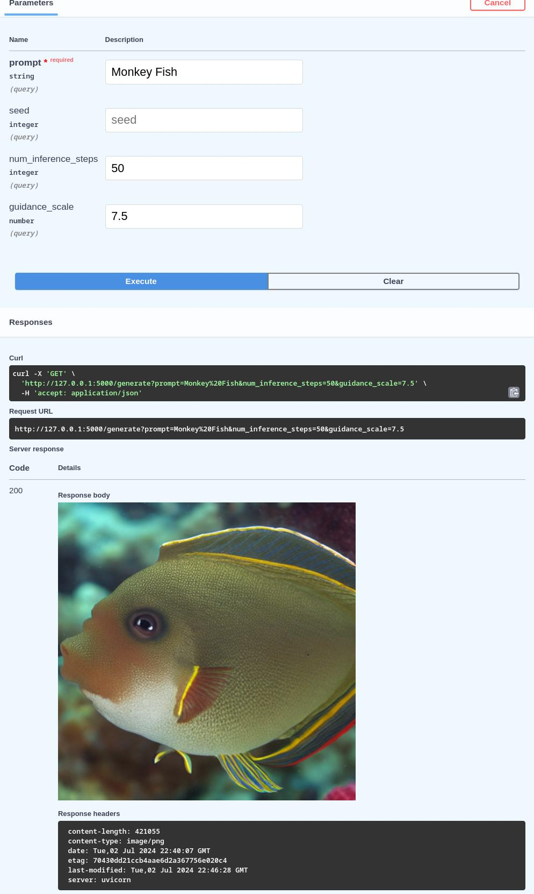

<p align = "center" draggable=”false” >
</p>


# <h1 align="center" id="heading">FastAPI for Stable Diffusion LLMs Demo</h1>

This repository contains the files to build your very own AI image generation web application! Outlined are the core components of the FastAPI web framework, and application leverage the newly-released Stable Diffusion text-to-image deep learning model.

📺 You can checkout the full video [here](https://www.youtube.com/watch?v=_BZGtifh_gw)!


![image.png]


**Local run example**
```
INFO:     127.0.0.1:59428 - "GET /openapi.json HTTP/1.1" 200 OK
Using device: cpu
100%|██████████| 50/50 [06:08<00:00,  7.37s/it]
INFO:     127.0.0.1:55088 - "GET /generate?prompt=Monkey%20Fish&num_inference_steps=50&guidance_scale=7.5 HTTP/1.1" 200 OK
```