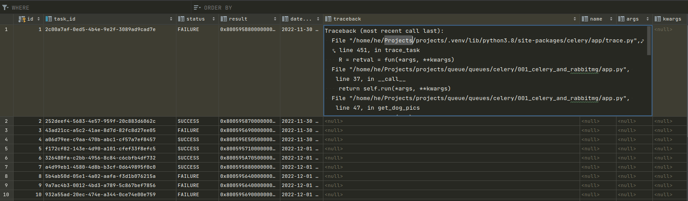

## Desc
Web application that uses artificial intelligence to enhance images.\
As the number of users increases, the time to enhance an image drastically increases, which leads to a significant delay while enhancing.\
Need for a task queue software as it efficiently manages requests and ensures that the application runs smoothly.

## Requirements
1) Install python dependencies.
2) install rabbitmq on the system as it runs in the background\
The -detached option allows us to run rabbitmq-server in the background. Now, we could use defaults, but it is always a good option to create a separate virtual host for our program.
```sh
sudo apt-get install rabbitmq-server
sudo rabbitmq-server -detached
```
3) Cfg server\
First ".*" gives the user the ability to configure every entity, the second ".*" gives the user write permissions on every entity, and the third ".*" gives the user read permissions on every entity.
```sh
sudo rabbitmqctl add_user root rootroot
sudo rabbitmqctl change_password root rootrootnew

sudo rabbitmqctl add_vhost vhost
sudo rabbitmqctl set_permissions -p vhost root ".*" ".*" ".*"
```
4) Add .env file

## App
Dog Pic Generator, so let’s call it GenDog. It works by making an API call to
https://dog.ceo/dog-api/ based on the breed selected by the user and the number
of pictures selected.

Use refresh page after request pictures (queue suppose to finish the work).


