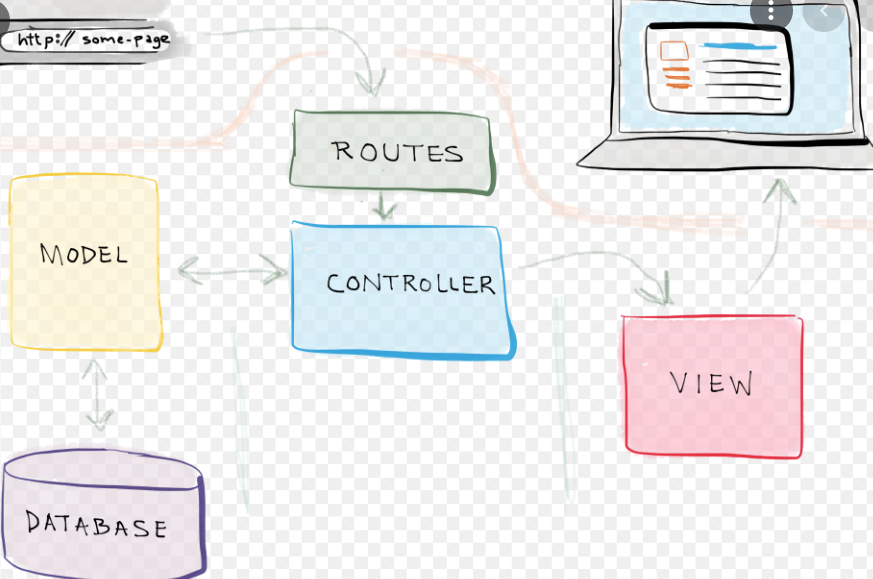

# Data-Driven Web App w/ Flask and SQLAlchemy
*replica of https://pypi.org/*

## Setup
- Clone the app project.
- Install requirements using poetry.
```
poetry add flask
poetry add pytest --dev
```

## Tech-stack


> BE
- Python3
- [Jinja](https://github.com/pallets/jinja) <br>
  Jinja is a fast, expressive, extensible templating engine. Special placeholders in the template allow writing code similar to Python syntax. Then the template is passed data to render the final document.
- [flask](https://github.com/pallets/flask) <br>
  Flask is a lightweight WSGI web application framework. It is designed to make getting started quick and easy, with the ability to scale up to complex applications. It began as a simple wrapper around Werkzeug and Jinja and has become one of the most popular Python web application frameworks.

  - [Werkzeug](https://github.com/pallets/werkzeug) <br>
    Werkzeug is a comprehensive WSGI web application library. It began as a simple collection of various utilities for WSGI applications and has become one of the most advanced WSGI utility libraries.
- [sqlalchemy](https://github.com/sqlalchemy/sqlalchemy) <br>
  SQLAlchemy is the Python SQL toolkit and Object Relational Mapper that gives application developers the full power and flexibility of SQL. SQLAlchemy provides a full suite of well known enterprise-level persistence patterns, designed for efficient and high-performing database access, adapted into a simple and Pythonic domain language.
- Linux
- [Nginx / uWSGI]()

  <p>uWSGI is a software application that "aims at developing a full stack for building hosting services".[3] It is named after the Web Server Gateway Interface (WSGI), which was the first plugin supported by the project.[3]<br>
  <p>uwsgi (all lowercase) is the native binary protocol that uWSGI uses to communicate with other servers.[4] <br>
  <p> uWSGI is often used for serving Python web applications in conjunction with web servers such as Cherokee and Nginx, which offer direct support for uWSGI's native uwsgi protocol.[5] For example, data may flow like this: HTTP client ↔ Nginx ↔ uWSGI ↔ Python app.<br>
  <p> Nginx is a web server that can also be used as a reverse proxy, load balancer, mail proxy and HTTP cache.<br>

> FE

- [HTML/CSS]()
  TODO
- [Bootstrap](https://github.com/twbs/bootstrap)
  Sleek, intuitive, and powerful front-end framework for faster and easier web development. <br>
- [JS]()
  TODO
- [Vue.js](https://github.com/vuejs/vue)
  Vue.js is a progressive, incrementally-adoptable JavaScript framework for building UI on the web. <br>

> DB

- [PostgreSQL](https://github.com/postgres/postgres)
  This directory contains the source code distribution of the PostgreSQL
  database management system. <br>
  PostgreSQL is an advanced object-relational database management system
  that supports an extended subset of the SQL standard, including
  transactions, foreign keys, subqueries, triggers, user-defined types
  and functions.  This distribution also contains C language bindings. <br>
- [Migrations]()
  TODO
- [Query language]()
  TODO

## Topics
1) Setup and tools
2) Introduction to Flask web framework
3) Creating our first site
4) HTML templates
5) Mapping URLs to methods
6) Bootstrap front-end framework
7) Data access with SQLAlchemy ORM
8) Database migrations with Alembic
9) User input with HTML forms
10) Server and client validation
11) Testing
12) Deployment
13) MongoDB version

## Requirements
1) **Python 3.x**
2) **poetry** - Dependency Management for Python.
```
# 1) Set Poetry always create virtual environment in the root directory. 
poetry config virtualenvs.in-project true

# 2) Navigate to the project dir
cd <project_dir>

# 3) Create a Virtual Environment (e.g. python = 3.10 - depends on os setup)
poetry init - pyproject.toml interactively create

poetry env use python
#* Switching between environments
poetry env use system
poetry env use python3.10
poetry env use /full/path/to/python

poetry lock - poetry.lock file, locking the project to those specific versions.

# 4) Activate Vitual Environment
poetry shell

# 5) Show env
which python
poetry env info --path
poetry env list --full-path - Find the list of virtual environments including its full path.

# 6) Remove env
poetry env remove /full/path/to/python
poetry env remove python3.10
poetry env remove 3.10
poetry env remove test-O3eWbxRl-py3.10

# 7) Add
poetry add "Flask==1.1.2"
poetry add "Flask==1.1.2" --dev - Adding package in dev-dependencies.
poetry add "/path/to/locallib" - Add local dependency by specifying the library path.

# 8) Delete dependencies
poetry remove Flask

# 9) Update dependencies
poetry update - Update all poetry packages that are defined in pyproject.toml.
poetry update Flask - update individual packages by specifying the name.
poetry show - Show the list of all packages installed with description.
poetry show Flask - Show information about a specific package.
```

# Description


**MVC (Model-View-Controller)** is a pattern in software design commonly used to implement user interfaces, data, and controlling logic. It emphasizes a separation between the software’s business logic and display. This "separation of concerns" provides for a better division of labor and improved maintenance.<br>

**Building Blocks of Flask**
1) **Routes:** Map URL patterns to views
   app.route maps URLs to views with a unique url pattern,
   optional HTTP verb, and route data.


2) **Controllers (View methods):** Process request


3) **Views (Templates):** Dynamic HTML
   Data passed to templates are keyword arguments.
   Can include data and methods.


4) **Models:** Data and behavior passed to view


5) **Static content:** Rich support for cached assets

   Static files will automatically be served from /static/...


6) **Configuration:** Dev, test, prod configs
