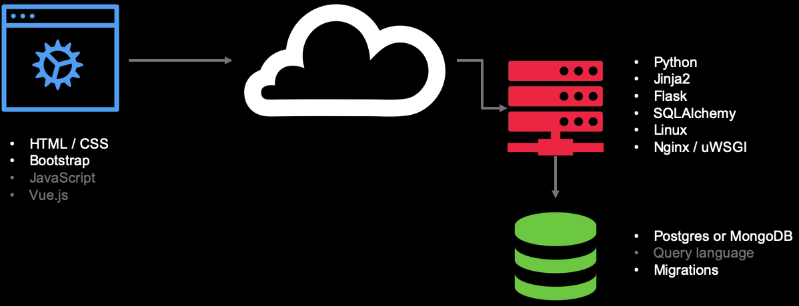

**Data-Driven Web App w/ Flask and SQLAlchemy**

**Tech-stack**

> BE

- Python3
- [Jinja](https://github.com/pallets/jinja)  
  Jinja is a fast, expressive, extensible templating engine. Special placeholders in the template allow writing code similar to Python syntax. Then the template is passed data to render the final document.
- [flask](https://github.com/pallets/flask)  
  Flask is a lightweight WSGI web application framework. It is designed to make getting started quick and easy, with the ability to scale up to complex applications. It began as a simple wrapper around Werkzeug and Jinja and has become one of the most popular Python web application frameworks.

  - [Werkzeug](https://github.com/pallets/werkzeug)  
    Werkzeug is a comprehensive WSGI web application library. It began as a simple collection of various utilities for WSGI applications and has become one of the most advanced WSGI utility libraries.
- [sqlalchemy](https://github.com/sqlalchemy/sqlalchemy)  
  SQLAlchemy is the Python SQL toolkit and Object Relational Mapper that gives application developers the full power and flexibility of SQL. SQLAlchemy provides a full suite of well known enterprise-level persistence patterns, designed for efficient and high-performing database access, adapted into a simple and Pythonic domain language.
- Linux
- [Nginx / uWSGI]()

  
uWSGI is a software application that "aims at developing a full stack for building hosting services".[3] It is named after the Web Server Gateway Interface (WSGI), which was the first plugin supported by the project.[3] 
  
uwsgi (all lowercase) is the native binary protocol that uWSGI uses to communicate with other servers.[4]  
  
 uWSGI is often used for serving Python web applications in conjunction with web servers such as Cherokee and Nginx, which offer direct support for uWSGI's native uwsgi protocol.[5] For example, data may flow like this: HTTP client ↔ Nginx ↔ uWSGI ↔ Python app. 
  
 Nginx is a web server that can also be used as a reverse proxy, load balancer, mail proxy and HTTP cache. 

> FE

- [HTML/CSS]()
  TODO
- [Bootstrap](https://github.com/twbs/bootstrap)
  Sleek, intuitive, and powerful front-end framework for faster and easier web development.  
- [JS]()
  TODO
- [Vue.js](https://github.com/vuejs/vue)
  Vue.js is a progressive, incrementally-adoptable JavaScript framework for building UI on the web.  

> DB

- [PostgreSQL](https://github.com/postgres/postgres)
  This directory contains the source code distribution of the PostgreSQL
  database management system.  
  PostgreSQL is an advanced object-relational database management system
  that supports an extended subset of the SQL standard, including
  transactions, foreign keys, subqueries, triggers, user-defined types
  and functions.  This distribution also contains C language bindings.  
- [Migrations]()
  TODO
- [Query language]()
  TODO
