# Data-Driven Web App w/ Flask and SQLAlchemy

**Flask / Jinja / Bootstrap / SQLAlchemy / Alembic** \
*replica of https://pypi.org/*

## Setup

1) Clone the app project.
2) Install requirements using poetry. 2.1) Python

```shell
cd web_apps/pypi
poetry config virtualenvs.in-project true
poetry shell
poetry install
```

or to just install the added package(s) (and remove any dev packages that were
already installed if you killed it too late):

```
poetry install --no-dev
```

[Creating a Flask Project](https://www.jetbrains.com/help/pycharm/creating-flask-project.html)


2.2) JS

```shell
cd web_apps/pypi
npm i or npm ci
npm install --save-dev
```

To use local css and js of bootstrap /pypi_org/templates/shared/_layout.html

```shell
cd web_apps/pypi/pypi_org
ln -s ../node_modules
```

```html

<link rel="stylesheet"
      href="/node_modules/bootstrap/dist/css/bootstrap.css">
```

3) Run app:

3.1) Setup IDE project structure
<p align="center">
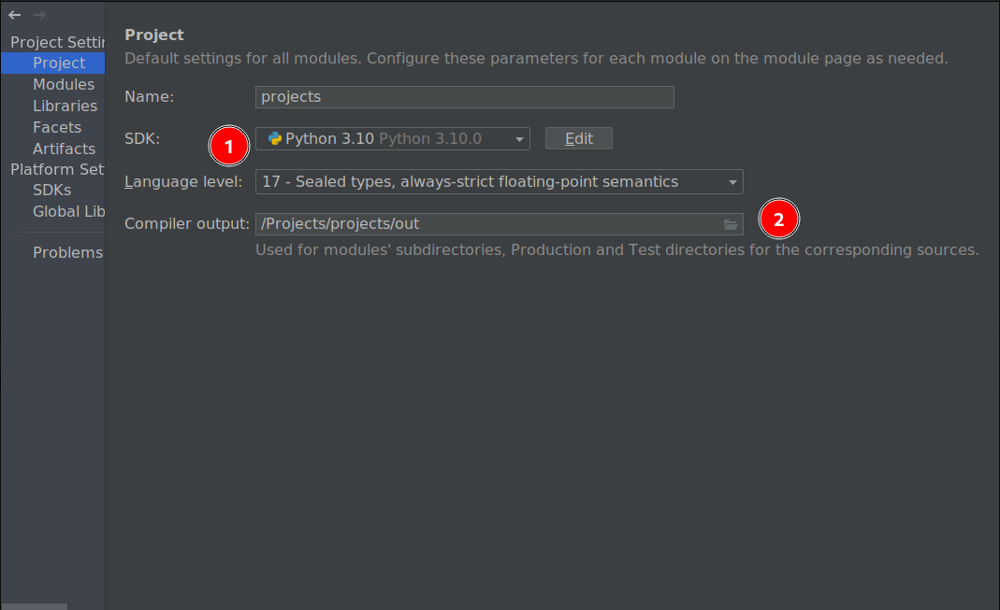
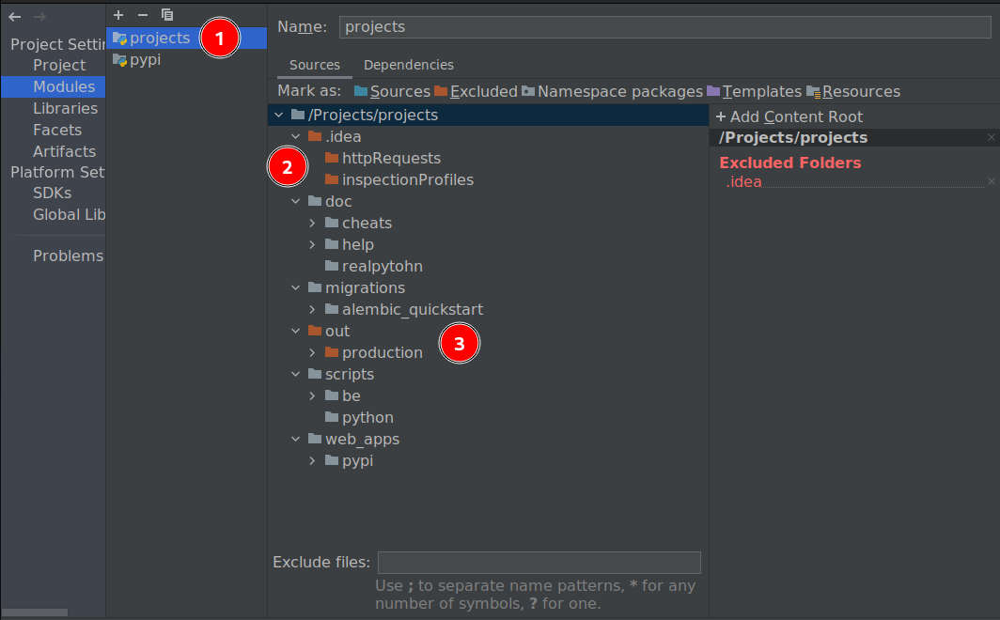
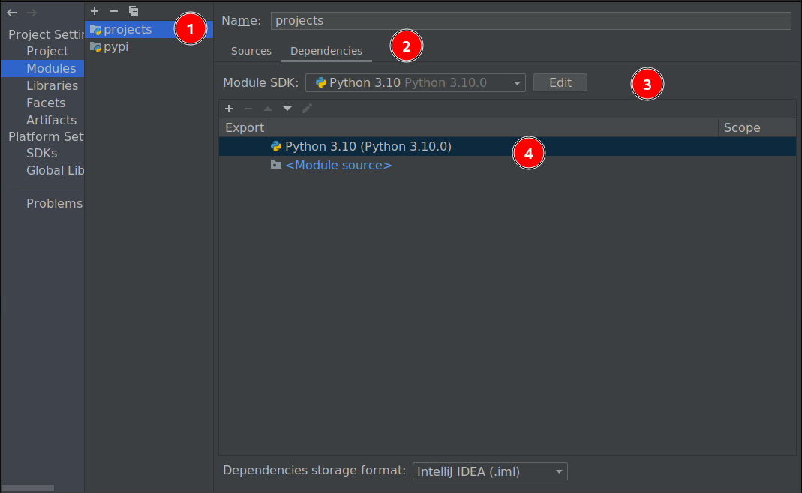
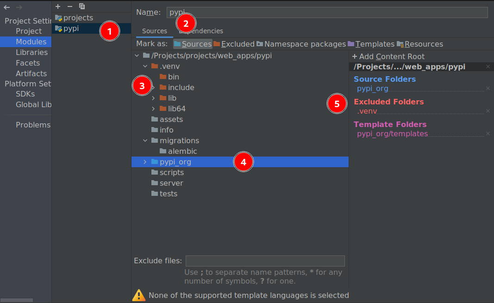
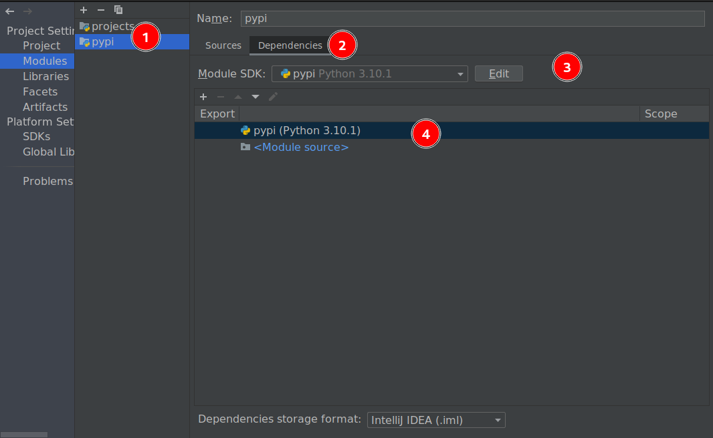
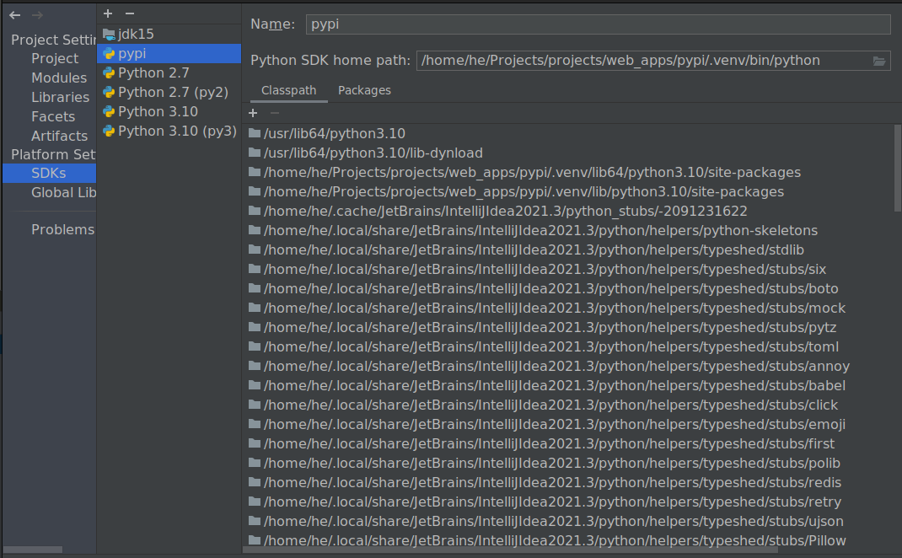
</p>

3.2) Run app via command interface:
`cd <project_dir>`
`scripts/run_app.sh`

3.3) Run app via IDE in debug mode:

**NOTE:**
Need plugin for IDE:
[EnvFile](https://plugins.jetbrains.com/plugin/7861-envfile)
<p align="center">
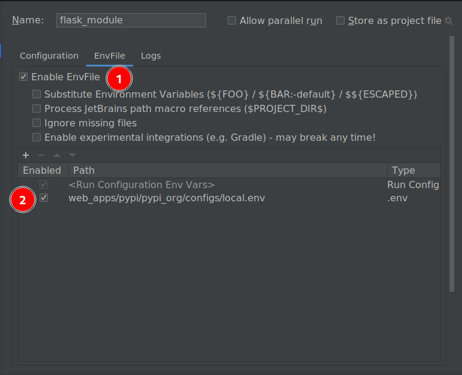
</p>

a) Flask module
<p align="center">
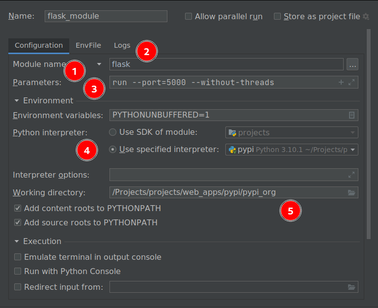
</p>

b) Python script app.py
<p align="center">
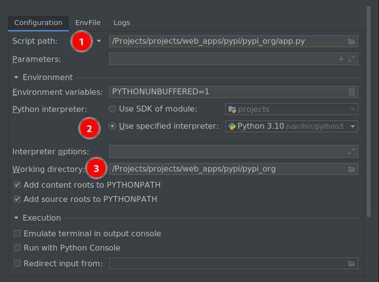
</p>

c) Flask framework \
[Run/Debug Configuration: Flask Server](https://www.jetbrains.com/help/pycharm/run-debug-configuration-flask-server.html)

<p align="center">
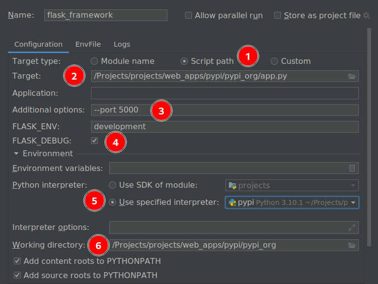
</p>

4) Run scripts:
```sh
cd projects/web_apps/pypi
./scripts/run_app.sh
./scripts/run_data_insert.sh
...
```

5) DB
```sh
sudo yum install python3-devel mysql-devel
```

6) Alembic:
```sh
cd web_apps/pypi/pypi_org/
alembic init alembic
sudo dnf install -y python3-alembic
alembic current
# make model changes
# https://alembic.sqlalchemy.org/en/latest/autogenerate.html
alembic revision --autogenerate -m "Added last_updated column to Package cls"
```

## Tips

1) Show project structure: \
    `tree -I .env`
2) Export requirements: \
    `poetry export -f requirements.txt --output requirements.txt`
3) IDE tab hack for html code:

    ```html
    div.container>div.row>div.col-md-4*3
    ```

    to
    
    ```html
    
    <div class="container">
        <div class="row">
            <div class="col-md-4"></div>
            <div class="col-md-4"></div>
            <div class="col-md-4"></div>
        </div>
    </div>```

4) **Errors:** \
a) sqlite3.ProgrammingError in IDE debug mode
    ```
    sqlite3.ProgrammingError: SQLite objects created in a thread can only be used in that same thread. The object was created in thread id 9744 and this is thread id 12712.
    ```

    **Fix:** Play w/ `Allow parallel run` option for debug run config.

5) **IDE:**\
- debug flask, alembic and rest of the modules using python module with parameters;
- 

## Tech-stack

<p align="center">
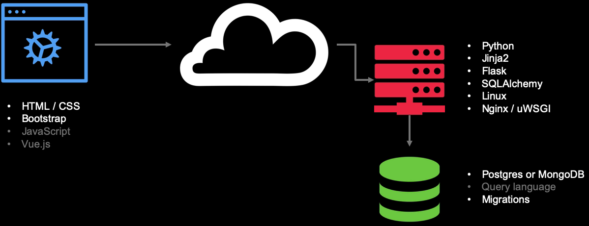
</p>

> BE

- Python3


- [Jinja](https://github.com/pallets/jinja) \
  Jinja is a fast, expressive, extensible templating engine. Special
  placeholders in the template allow writing code similar to Python syntax.
  Then the template is passed data to render the final document. \
  [Jinja Templates](https://jinja.palletsprojects.com/en/3.0.x/templates/)


- [flask](https://github.com/pallets/flask) \
  Flask is a lightweight WSGI web application framework. It is designed to make
  getting started quick and easy, with the ability to scale up to complex
  applications. It began as a simple wrapper around Werkzeug and Jinja and has
  become one of the most popular Python web application frameworks. \
  [Flask layout](https://flask.palletsprojects.com/en/2.0.x/tutorial/layout/) \
  [Advanced patterns for views and routing](http://exploreflask.com/en/latest/views.html) \
  `FLASK_DEBUG=1` - auto-reload the flask app when a code change happens
  `FLASK_DEBUG=0` - to debug via IDE instead of seeing stacktrace in browser \
  [Flask 2 time run issue](https://stackoverflow.com/questions/25504149/why-does-running-the-flask-dev-server-run-itself-twice)


- [Werkzeug](https://github.com/pallets/werkzeug) \
  Werkzeug is a comprehensive WSGI web application library. It began as a
  simple collection of various utilities for WSGI applications and has become
  one of the most advanced WSGI utility libraries.


- [sqlalchemy](https://github.com/sqlalchemy/sqlalchemy) \
  SQLAlchemy is the Python SQL toolkit and Object Relational Mapper that gives
  application developers the full power and flexibility of SQL. SQLAlchemy
  provides a full suite of well known enterprise-level persistence patterns,
  designed for efficient and high-performing database access, adapted into a
  simple and Pythonic domain language. \
  [SQLAlchemy Docs](https://docs.sqlalchemy.org/en/14/) \
  [Key Features of SQLAlchemy](https://www.sqlalchemy.org/features.html)

  <p align="center">
  
  </p>

  [Engine Configuration](https://docs.sqlalchemy.org/en/13/core/engines.html) 
  <p align="center">
  
  </p>
  
  **ORM queries**
  <p align="center">
  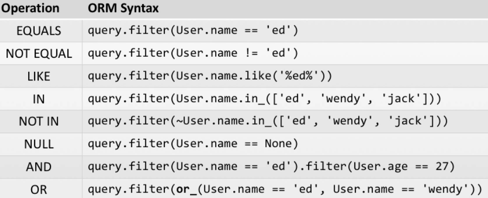
  </p>

- Linux


- [Nginx / uWSGI]()

  <p>uWSGI is a software application that "aims at developing a full stack for building hosting services".[3] It is named after the Web Server Gateway Interface (WSGI), which was the first plugin supported by the project.[3]\
  <p>uwsgi (all lowercase) is the native binary protocol that uWSGI uses to communicate with other servers.[4] \
  <p> uWSGI is often used for serving Python web applications in conjunction with web servers such as Cherokee and Nginx, which offer direct support for uWSGI's native uwsgi protocol.[5] For example, data may flow like this: HTTP client ↔ Nginx ↔ uWSGI ↔ Python app.\
  <p> Nginx is a web server that can also be used as a reverse proxy, load balancer, mail proxy and HTTP cache.\

> FE

- [HTML/CSS]()


- [Bootstrap](https://github.com/twbs/bootstrap) \
  Sleek, intuitive, and powerful front-end framework for faster and easier web
  development. \
  Quickly design and customize responsive mobile-first sites with Bootstrap,
  the world’s most popular front-end open source toolkit, featuring Sass
  variables and mixins, responsive grid system, extensive prebuilt components,
  and powerful JavaScript plugins. \
  [Get Bootstrap](https://getbootstrap.com/docs/5.1/getting-started/download/)

  **Alternatives:**
    - https://github.com/semantic-org/semantic-ui
    -


- [JS]
    - [jQuery](https://jquery.com/) \
      jQuery is a fast, small, and feature-rich JavaScript library. It makes
      things like HTML document traversal and manipulation, event handling,
      animation, and Ajax much simpler with an easy-to-use API that works
      across a multitude of browsers. With a combination of versatility and
      extensibility, jQuery has changed the way that millions of people write
      JavaScript. \

    - [popper](https://popper.js.org/) \
      Popper.js is a positioning engine, its purpose is to calculate the
      position of an element to make it possible to position it near a given
      reference element. \
      Popper.js has zero dependencies. No jQuery, no LoDash, nothing. It's used
      by big companies like Twitter in Bootstrap v4, Microsoft in WebClipper
      and Atlassian in AtlasKit. \
      Some of the key points are:
        - Position elements keeping them in their original DOM context (doesn't
          mess with your DOM!);
        - Allows to export the computed information to integrate with React and
          other view libraries;
        - Supports Shadow DOM elements;
        - Completely customizable thanks to the modifiers based structure;

    - [Vue.js](https://github.com/vuejs/vue) \
      Vue.js is a progressive, incrementally-adoptable JavaScript framework for
      building UI on the web.

> DB

- [PostgreSQL](https://github.com/postgres/postgres) \
  This directory contains the source code distribution of the PostgreSQL
  database management system. \
  PostgreSQL is an advanced object-relational database management system that
  supports an extended subset of the SQL standard, including transactions,
  foreign keys, subqueries, triggers, user-defined types and functions. This
  distribution also contains C language bindings.


- [Migrations]()
  [alembic](https://github.com/sqlalchemy/alembic) \
  

- [Query language]()

## Topics

1) Setup and tools
2) Introduction to Flask web framework
3) Creating our first site
4) HTML templates
5) Mapping URLs to methods
6) Bootstrap front-end framework
7) Data access with SQLAlchemy ORM
8) Database migrations with Alembic
9) User input with HTML forms
10) Server and client validation
11) Testing
12) Deployment
13) MongoDB version

## Requirements

1) **Python 3.x**
2) **poetry** - Dependency Management for Python.

# Description

<p align="center">
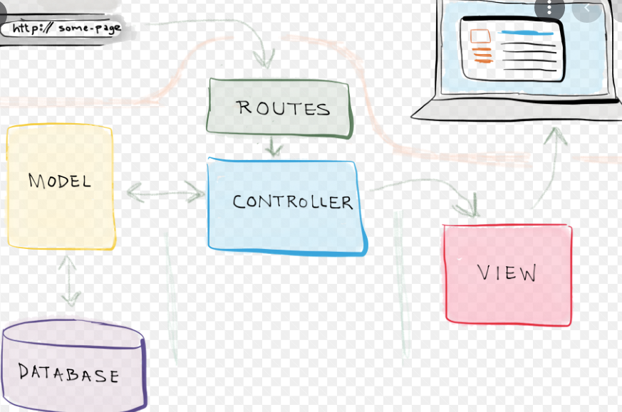
</p>

**MVC (Model-View-Controller)** is a pattern in software design commonly used
to implement user interfaces, data, and controlling logic. It emphasizes a
separation between the software’s business logic and display. This "separation
of concerns" provides for a better division of labor and improved maintenance.\

**Building Blocks of Flask**

1) **Routes:** Map URL patterns to views app.route maps URLs to views with a
   unique url pattern, optional HTTP verb, and route data.


2) **Controllers (View methods):** Process request


3) **Views (Templates):** Dynamic HTML Data passed to templates are keyword
   arguments. Can include data and methods.


4) **Models:** Data and behavior passed to view


5) **Static content:** Rich support for cached assets

   Static files will automatically be served from /static/...


6) **Configuration:** Dev, test, prod configs
